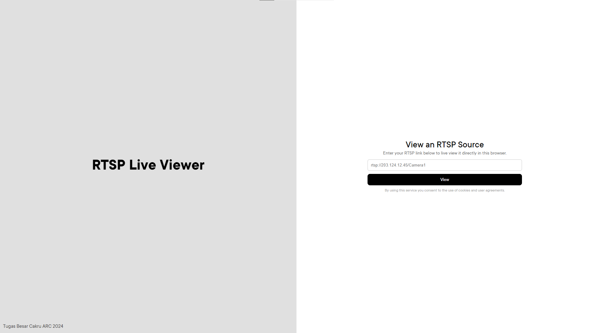
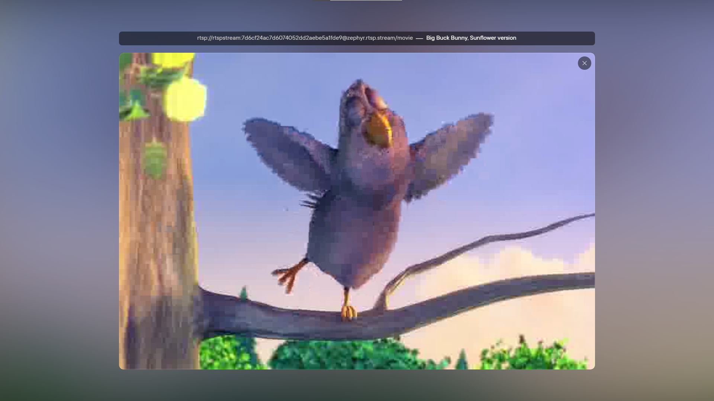
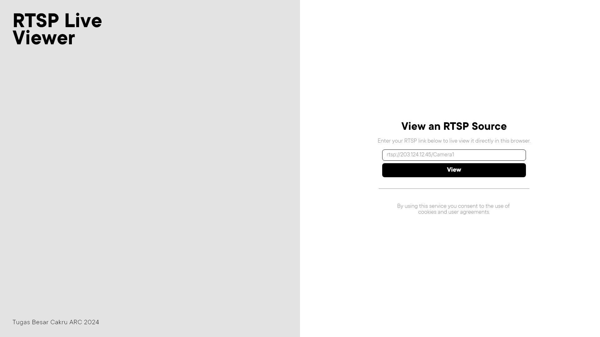
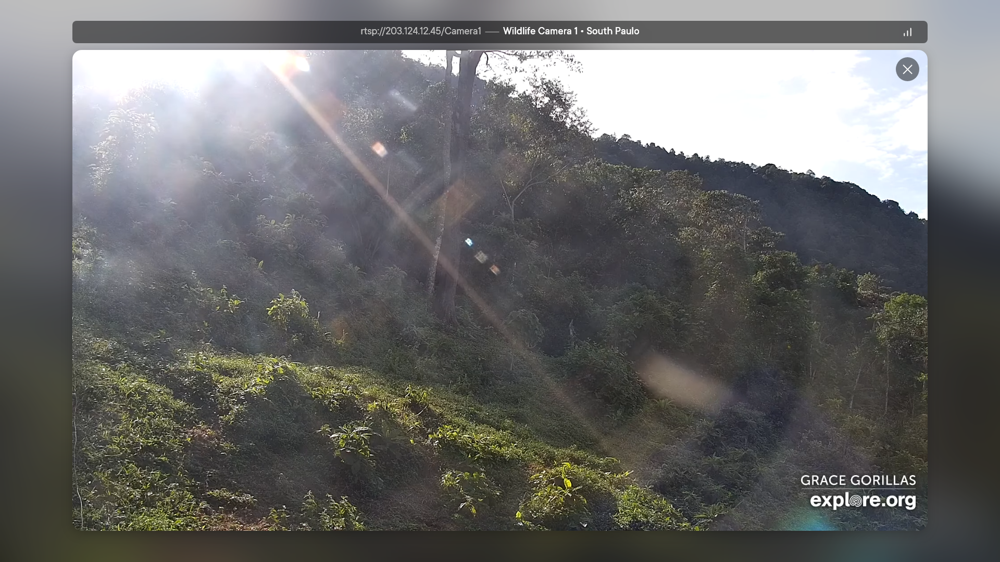

# RTSP Live Viewer

_A tool to live view RTSP source directly from browser._

Sebuah alat untuk melihat siaran sumber RTSP secara langsung melalui browser.

## Final Screenshot

_Main page: Simple landing page with input box to enter an RTSP link._

_Viewer page: Beautiful page containing RTSP video._

## Design Reference

## Try it out yourself!

### Running the server
1. `git clone` this repository
2. `npm install`
3. `npm run start`
4. That's it!

### Testing from browser
1. Open http://localhost:3000
2. Enter your RTSP link into the provided box
3. Click `View` button

## Implementation Notes
1. This project uses ffmpeg on server side to decode RTSP and encode it back to the client. 
2. The client utilizes jsmpeg which is a library to decode simple mpegts packets.
3. For routing, this project uses expressjs with websocket functionality. 
4. Additionaly, this project also uses no-delay TCP option and compression to enhance latency and performance concerns.
